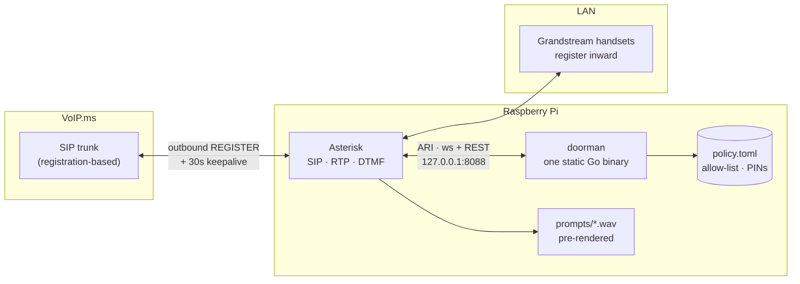
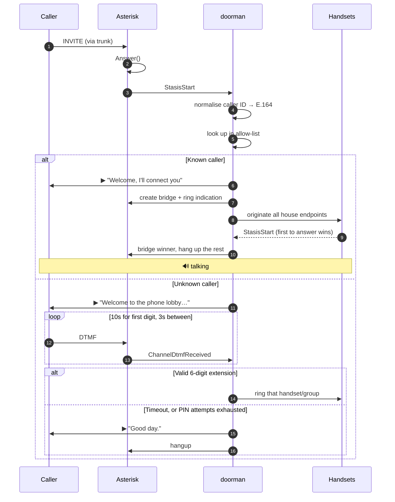
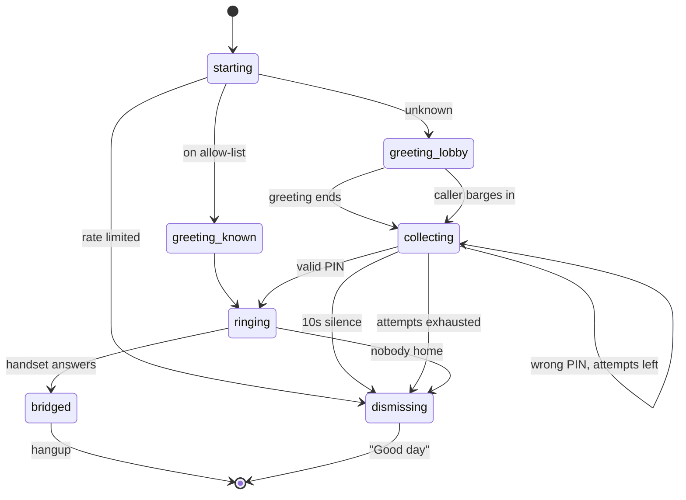

<p align="center">
  
</p>

<p align="center">
  
</p>

# Call Me Maybe


**A programmable home phone. Known callers ring the whole house; everyone else
meets the bouncer. Runs happily on a spare Raspberry Pi.**

[callmemaybe.cc](https://callmemaybe.cc)


*The home phone my kids never saw coming.*

A programmable home phone. A Raspberry Pi is the obvious host — cheap, silent,
and it only has to do one thing — but anything that runs Asterisk will do.

Known callers hear *"Welcome, I'll connect you"* and the whole house rings. Everyone else meets the lobby: dial a 6-digit extension, or the bouncer says *"Good day"* and hangs up.

No port forwarding. No inbound firewall rules. The Pi registers **outbound** to a VoIP provider and the trunk rides that registration back in.

```
                 ┌─ known caller ──→ "Welcome, I'll connect you" ──→ 🔔 whole house
inbound call ──→ ┤
                 └─ unknown ───────→ "Welcome to the phone lobby.
                                      Please dial an extension." ──→ ✓ that handset rings
                                                                 └─→ ✗ "Good day." *click*
```

---

<sub>**Repo metadata** — description: *A programmable home phone. Known callers
ring the whole house; everyone else meets the bouncer. Runs happily on a spare
Raspberry Pi.* · topics: `asterisk` `voip` `sip` `raspberry-pi` `pbx` `homelab`
`self-hosted` `home-automation` `golang` `telephony`</sub>

## How it fits together

Asterisk does SIP, RTP, and DTMF detection. It is very good at those and there is no reason to reimplement them. Everything about *who gets in* lives in `doorman`, a single static Go binary that talks to Asterisk over ARI on loopback — one call is one goroutine, and the caller hanging up cancels a context that unwinds everything.



The only connection that crosses the WAN is one the Pi opens itself.

Beyond the lobby, the handsets get the classic PBX toolkit — paging/intercom
(500), call parking (700), a family conference (600), BLF busy lamps, hold
music, voicemail with email delivery (*97), ringer ladders that escalate
kids → adults → voicemail, per-extension afterhours windows, and an optional
dial-555 hook into Home Assistant's Assist. Details in
[`docs/RUNBOOK.md`](docs/RUNBOOK.md).

### A call, end to end



### Lobby state machine



---

## Repo layout

```
call-me-maybe/
├── CLAUDE.md              project memory — invariants, conventions, commands
├── .claude/skills/        /diagnose-call, /add-person, /ship
├── cmd/doorman/           entrypoint, subcommands, ARI event router
├── internal/render/       handsets.toml → generated Asterisk config
├── internal/lobby/        the state machine — lobby, bouncer, ring groups + fake-ARI tests
├── internal/policy/       allow-list, PINs, E.164, hot reload, PIN rotation
├── internal/ari/          thin typed ARI client (REST + reconnecting WebSocket)
├── internal/lsp/          language server — same validator, as you type
├── internal/config/       env parsing, names match examples/.env.example
├── examples/              .env / policy / handsets templates to copy
├── asterisk/              pjsip / extensions / ari / http / rtp config
├── prompts/               prompt text + piper build script
├── scripts/               systemd unit, smoke.sh, coverage floors
├── tools/                 nested module: custom analyzers (not linked into doorman)
├── .githooks/             pre-push gate, installed by `make hooks`
├── .github/workflows/     CI and tag-driven releases
├── install.sh             release installer — detects host, verifies checksums
├── site/                  callmemaybe.cc — the public site
├── ecomm/                 store.callmemaybe.cc — pack storefront
└── docs/                  RUNBOOK · TASKS · architecture · roadmap
```

`lobby` and `bouncer` aren't separate services — they're two branches of one state machine, so splitting them would add a network hop and no seam. `speech` isn't a service either: prompts are rendered once with piper and committed as WAVs, so the Pi never does TTS and a broken speech service can never make the phone unreachable. And doorman ships as one statically linked binary (`make cross` covers both 64-bit and 32-bit Pi OS) — nothing to install on the Pi but the file itself.

---

## Setup

### 1. VoIP.ms

Do this first; the values feed straight into `pjsip.conf`.

- **Sub Accounts → Create Sub Account.** Don't put your main login on the Pi. Auth type *User/Password*, device type generic ATA/IP phone, **NAT: yes**. You'll get a username like `123456_home`.
- **Pick the POP nearest you** and use that exact hostname everywhere.
- **DIDs → Manage DID → route it to that sub account.**
- **Codecs:** ulaw first, g722 second, disable the rest. A Pi has no business transcoding.
- **Enable E911 on the DID.** It's a couple of dollars a month and it's the one line item worth not skipping on a house phone.

### 2. Asterisk on the Pi

```bash
sudo apt install asterisk
cd /etc/asterisk
sudo cp /opt/call-me-maybe/asterisk/*.conf .
sudo cp /opt/call-me-maybe/asterisk/pjsip.conf.example pjsip.conf
sudo cp /opt/call-me-maybe/asterisk/ari.conf.example ari.conf
# edit pjsip.conf (sub account, POP, handset passwords) and ari.conf (password)
sudo systemctl restart asterisk
```

Confirm the trunk came up:

```bash
sudo asterisk -rx "pjsip show registrations"    # want: Registered
sudo asterisk -rx "pjsip show endpoints"
```

### 3. Prompts

On a workstation with piper and ffmpeg (not the Pi):

```bash
bash prompts/build.sh
rsync -av prompts/build/ pi@raspberrypi:/tmp/cmm-prompts/
```

Then on the Pi:

```bash
sudo mkdir -p /var/lib/asterisk/sounds/call-me-maybe
sudo cp /tmp/cmm-prompts/* /var/lib/asterisk/sounds/call-me-maybe/
sudo chown -R asterisk:asterisk /var/lib/asterisk/sounds/call-me-maybe
```

### 4. doorman

Configuration is three files with three jobs: **`.env`** holds secrets,
**`handsets.toml`** holds the hardware (and `doorman render` generates the
per-handset Asterisk config from it, so inventory and dialplan can't drift),
and **`policy.toml`** holds the rules — allow-list, extensions, ladders, and
named `[[schedules]]` referenced as `afterhours = "school-night"`.

Editing those files gets IDE support: `doorman lsp` is a language server
whose diagnostics come from the same validator that guards the daemon —
unknown handset ids, bad schedule references, and duplicate PINs get
squiggles as you type, with completions for every cross-reference. Works in
Neovim over SSH on the Pi with zero extra installation. See
[`docs/editor.md`](docs/editor.md).

On a workstation:

```bash
make cross
scp bin/doorman-linux-arm64 pi@raspberrypi:/opt/call-me-maybe/bin/doorman
# (uname -m says armv7l on the Pi? use bin/doorman-linux-armv7 instead)
```

On the Pi:

```bash
cp examples/.env.example .env                    # set ARI_PASSWORD to match ari.conf
cp examples/policy.example.toml policy.toml      # allow-list + extensions
./bin/doorman check
```

Then `sudo cp scripts/doorman.service /etc/systemd/system/` and enable it.

Or skip the build and take a release binary:

```bash
curl -fsSL https://raw.githubusercontent.com/ericdmoore/call-me-maybe/main/install.sh | bash
```

It detects your OS and architecture, verifies the SHA-256 against the
published checksums, and installs to `/usr/local/bin` (or `~/.local/bin` when
that isn't writable). `--version`, `--prefix`, and `--force` all work.

---

## Suggested hardware

`doorman` has no opinion about brands. Anything that registers to Asterisk as
a SIP endpoint works — `handsets.toml` only needs a `PJSIP/<id>`, and
`doorman render` generates the rest. So buy on ergonomics and price, not
compatibility.

### The Pi

Asterisk plus one Go binary is a light load; the phone plant is idle almost
all the time. **A Pi 4 (2 GB) or Pi 5 is plenty, and a 3B+ is fine** — this
is a genuinely good use for the one already in your drawer.

#### Raspberry Pi

* [Pi 5 on Amazon](https://amzn.to/3S3E5vV) — most headroom, wants active cooling and the 5 V/5 A supply
* [Pi 4 on Amazon](https://amzn.to/3RYUgdU) — the sweet spot; 2 GB is ample, and a PoE HAT fits
* [Pi 3 on Amazon](https://amzn.to/4xghXxv) — cheapest that still has wired Ethernet

What actually matters more than the model:

- **Use wired Ethernet for the Pi itself.** WiFi jitter on the box doing RTP
  is the difference between clear audio and someone sounding underwater. This
  is the one hardware choice worth being rigid about. (A Pi Zero 2 W has no
  Ethernet port — it needs a USB adapter, at which point buy a 4.)
- **Boot from a USB SSD if you can, or use an A2 microSD.** A 24/7 service
  writing logs and voicemail is the classic way to wear out a cheap card, and
  the failure looks like a phone that mysteriously stopped answering.
- **A PoE HAT** on a Pi 4 gets you power and network over one cable, which is
  what you want if it lives in a closet next to the switch.
- **Put it on a small UPS.** A house phone that dies in a power cut is worse
  than no house phone, because you thought you had one. (VoIP still dies with
  your internet — which is exactly why the E911 note above matters.)

### Handsets

Grandstream's Wi-Fi handsets are what this was built and tested against:

#### Grandstream Cordless WiFi IP Phone WP826 SIP Phone
[on Amazon](https://amzn.to/44YDPRP)

#### Grandstream WP816 Compact Portable Wi-Fi Phone
[on Amazon](https://amzn.to/4yMiB7h)

### Other good-value options

Every one of these registers over SIP and drops into `handsets.toml`
unchanged — the type column is the decision that matters, not the brand.

| Model | Type | Notes |
|---|---|---|
| [Grandstream HT812 V2](https://amzn.to/4yS8Wwc) | ATA · 2× FXS | Puts analog phones you already own on the lobby — an existing cordless base, or a 1950s rotary. Two ports, so two `[[handsets]]` entries. Usually the cheapest way to cover rooms, and the most fun. |
| [Grandstream DP752](https://amzn.to/4ftcHAr) | DECT base | Carries several DP7xx handsets, each registering as its own SIP account — one `[[handsets]]` entry per handset, exactly like a desk phone. |
| [Grandstream DP730](https://amzn.to/4vYvEzV) | DECT handset | Pairs to the DP752. Buy one per room. |
| [Yealink W73P](https://amzn.to/4wyMO8q) | DECT bundle | W70B base + W73H handset. The straightforward place to start. |
| [Yealink W73P + extra W73H](https://amzn.to/3TLJSXn) | DECT bundle | Same, second handset in the box — cheaper than adding one later. |
| [Yealink W79P](https://amzn.to/4fMKbZx) | DECT bundle | W70B base + W59R, the ruggedised handset — the one to pick if it's going to get dropped. |
| [Yealink W79P + 1 extra W59R](https://amzn.to/4h4kR3x) | DECT bundle | Two rugged handsets. |
| [Yealink W79P + 2 extra W59R](https://amzn.to/4pMK04N) | DECT bundle | Three handsets — cheapest route to a whole-house cordless set. |
| [Grandstream GRP2601P](https://amzn.to/4fLsxFy) | Desk · PoE | Entry desk phone. `P` = PoE, so one cable carries power and network. |
| [Grandstream GRP2602P](https://amzn.to/4hEZPZm) | Desk · PoE | Same family, the higher tier of the two. |
| [Grandstream GRP2602W](https://amzn.to/3S3jI1R) | Desk · Wi-Fi | `W` = built-in Wi-Fi, for a room with no Ethernet drop. Prefer the `P` anywhere you have a cable. |
| [Yealink T31P](https://amzn.to/4pKnQAe) | Desk · PoE | Very common, well built, cheap. A safe default. |
| [Fanvil X3U](https://amzn.to/4xbLUyA) | Desk · PoE | About as cheap as this gets while still being pleasant to use. |
| [Cisco SPA504](https://amzn.to/44Ww1QC) | Desk · PoE | The classic four-line workhorse, and abundant secondhand. Factory-reset anything used — it may still be provisioned to its last owner. |

**Wi-Fi vs DECT vs wired, honestly:** Wi-Fi handsets are convenient and give
you one less base station, but they hand off between access points poorly —
walk from the kitchen to the garage mid-call and you may lose it. DECT is the
technically better answer for cordless and its batteries last far longer.
Wired PoE desk phones never surprise you at all. A sensible house is usually
a couple of wired phones in fixed spots plus one cordless system.

Two options with nothing to buy: **used Poly VVX and Cisco SPA units** flood
the market from office decommissions at a fraction of new, and a **softphone**
(Linphone is free; Groundwire on a kid's phone) is a real SIP endpoint — the
easiest way to test a ringer ladder before spending anything.

<sub>**Disclosure:** the Amazon links on this page are affiliate links — if you
buy through one, the project earns a commission at no cost to you. Nothing
here is sponsored and no vendor has been paid for placement. Be aware of the
obvious bias anyway: everything with a link earns something, so the honest
guidance is the part that doesn't — `doorman` works with *any* SIP endpoint,
the ATA row means the phones already in your house may need nothing bought at
all, and a free softphone will test your whole ladder before you spend a
cent.</sub>

---

## Design notes

**Ten seconds is for the first digit, not all six.** A stranger reading a PIN off a card needs longer than a stopwatch allows. The window is 10s to the *first* digit, then 3s between digits — so a confident caller is through in two seconds and a fumbling one still gets a fair shot. Both are tunable in `.env`.

**Extensions are PINs, so treat them like passwords.** A 6-digit keypad exposed to the PSTN is a million combinations — plenty against a human, not much against a machine that can redial. After three failed calls in an hour, a number skips the greeting entirely and goes straight to "Good day": no prompt, no dial window, nothing to brute-force against. And don't pick PINs at all: `doorman rotate` generates them with crypto/rand, rewrites `policy.toml` in place (comments intact), and the running daemon picks the change up within a second.

**Caller ID is normalised before anything looks at it.** VoIP.ms passes the calling number roughly as the originating carrier hands it over, so the same person shows up as `5125550100`, `15125550100`, and `+15125550100` on different days. Compare raw strings and Grandma meets the bouncer about a third of the time. Everything folds to E.164 first — probe any value with `doorman e164 "(512) 555-0100"`.

**A bad `policy.toml` can't take the phone down.** Edits are picked up live, but a file that fails validation is logged and discarded — the last good policy stays in service. Run `doorman check` before you rely on it anyway.

**Withheld caller ID always meets the bouncer.** Anonymous callers share a single rate-limit bucket, which means one persistent blocked caller can dismiss others faster. That's the intended trade.

---

## Working on this

`CLAUDE.md` is loaded automatically by Claude Code and carries the invariants —
the things that, if broken, fail in ways that look like working software.
[`docs/RUNBOOK.md`](docs/RUNBOOK.md) has provisioning, a bottom-up verification
ladder, a symptom-to-cause troubleshooting table, and the raw ARI calls for
probing by hand. [`docs/TASKS.md`](docs/TASKS.md) is the backlog with acceptance
criteria.

Three skills ship with the repo: `/diagnose-call`, `/add-person`, `/ship`.

```bash
make hooks                # once per clone — installs the pre-push gate
make check                # gofmt + vet + lint + test + build
make cover                # -race, plus per-package coverage floors
make lint                 # nilness + the no-secrets-in-logs analyzer
./scripts/smoke.sh        # on the Pi — verifies the whole chain
```

The invariant that caller IDs and PINs never reach the logs is enforced by a
custom `go/analysis` pass rather than by review: `tools/nologsecrets` rejects
a PIN or caller number passed to any `slog` call, while still allowing
`len(digits)` and `tail(number)`. It lives in a nested module so
`golang.org/x/tools` never enters the daemon's dependency graph.

### Asking the binary instead of reading the source

`doorman schema` prints the whole configuration surface as JSON Schema — every
key, type, pattern, default, and cross-file reference across `policy.toml`,
`handsets.toml`, and the environment:

```bash
doorman schema             # all three, as one bundle
doorman schema policy      # or just one
```

It exists because `policy.toml` is the real interface to this system, and the
only machine-readable knowledge of its shape used to live inside the
validator — which will tell you whether a file is valid but not what a valid
file looks like. Handy for editor integration, for generating config, and for
handing a language model the rules instead of hoping it infers them.

It describes *shape*, not validity. JSON Schema cannot express "this ladder
step names a handset that must exist in `handsets.toml`", `handsets` XOR
`steps`, or the roughly thirty semantic checks behind `doorman check`; those
are carried as `x-cross-references` and `x-rules` annotations, and the
document says so about itself. `doorman check` is still the authority.

Because it is hand-authored, `internal/schema`'s tests fail if a `toml` tag or
an environment variable exists in Go without a matching schema entry — the
schema cannot quietly fall behind the code.

There is a man page at [`docs/doorman.1`](docs/doorman.1) (`make man` to read
it from the working tree; `install.sh` installs it), and
[`llms.txt`](llms.txt) orients a language model arriving with no other
context. Both lead with `doorman schema`.

The pre-push hook (`.githooks/pre-push`, versioned with the code) blocks a
push on unformatted code, vet findings, failing tests, an example config that
stopped validating, or a secret force-added past `.gitignore`. CI runs the
same checks on every push and pull request, cross-compiles both Pi targets,
and shellchecks the shipped scripts. Tagging with `make release-tag TAG=x.y.z`
builds all five targets, stamps the version into each binary, and publishes a
release with SHA-256 checksums that `install.sh` verifies.

The state machine in `internal/lobby/session.go` is fully covered through the
fake-ARI harness in `internal/lobby/fake_ari_test.go` — known callers,
valid/invalid PINs, timeouts, barge-in, ring-group races, and mid-call hangups
all run without an Asterisk.

## Not built yet

Voicemail is sketched but not wired: `record` on the caller channel → whisper on a beefier box → email with the transcript and the original audio attached. The `.env` block for it is parsed and ignored so the shape is settled. See [`docs/roadmap.md`](docs/roadmap.md).

## Packs

The bouncer's personality is a swappable folder of audio. `PROMPT_MEDIA_PREFIX`
points at a pack; drop in another and the lobby greets strangers as a Victorian
doorman, a bureaucrat, or a ship's computer instead. The format is specified
and CC0 — see [`docs/PACKS.md`](docs/PACKS.md) to build one.

The line this project holds: **mechanisms are free, content is optional.**
Every mechanism — lobby, bouncer, ladders, hold, sound board — is Apache 2.0
and works completely with the bundled pack. Packs make it more fun; nothing
requires buying one. See [`docs/SUSTAINABILITY.md`](docs/SUSTAINABILITY.md)
for how that squares with paying for the project's upkeep.

## License

Code is [Apache 2.0](LICENSE). Bundled audio and the pack format are licensed
separately — see [`LICENSES.md`](LICENSES.md) for the full split, and
[`CONTRIBUTING.md`](CONTRIBUTING.md) (no CLA required).
