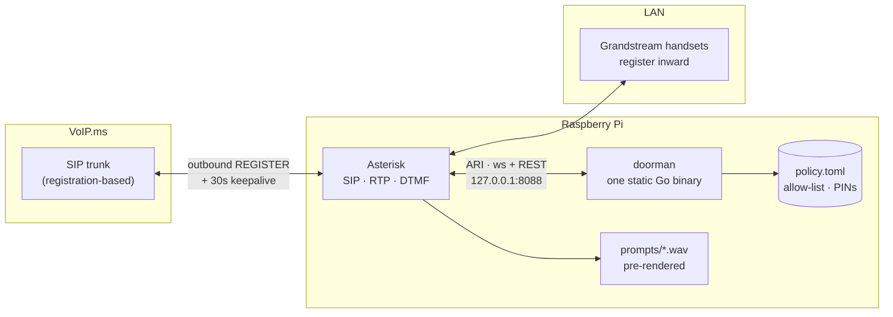
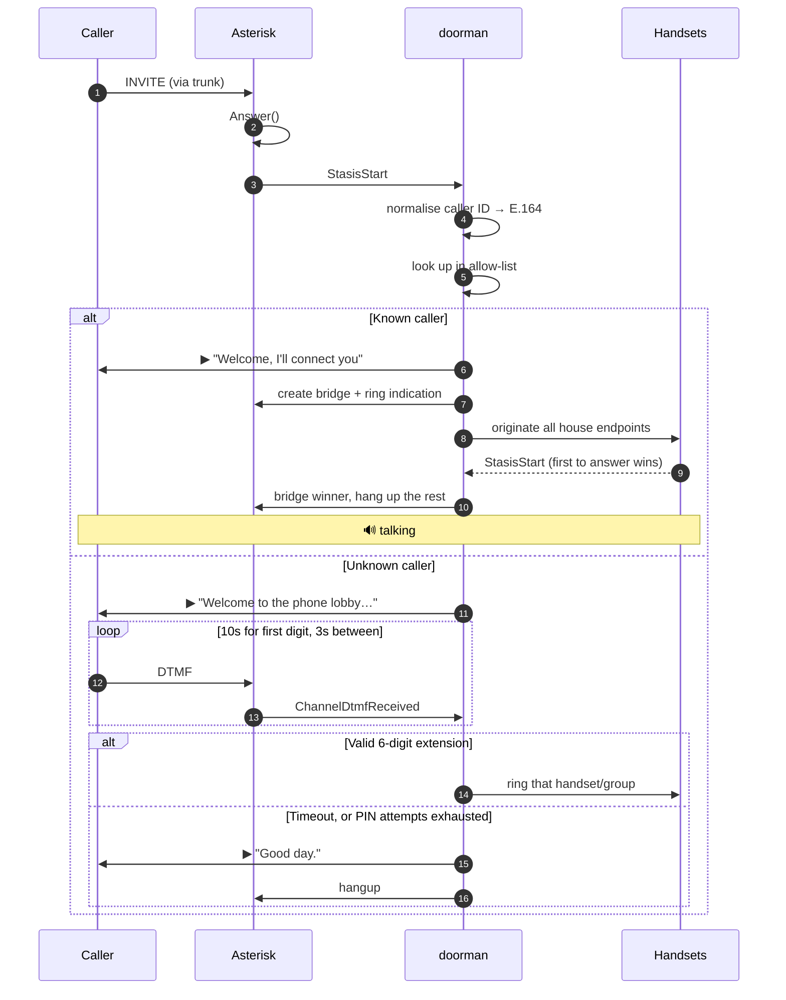
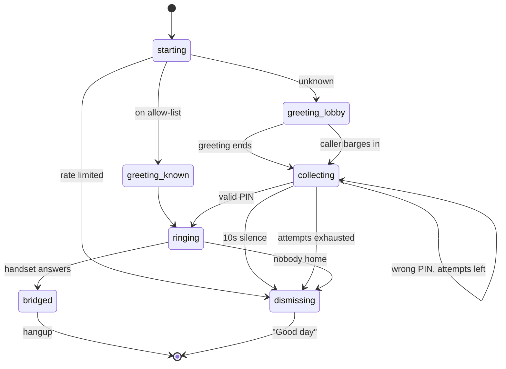

# Call Me Maybe


**A programmable home phone for a spare Raspberry Pi. Known callers ring the
whole house; everyone else meets the bouncer.**

[callmemaybe.cc](https://callmemaybe.cc)


*The home phone my kids never saw coming.*

A programmable home phone that runs on a spare Raspberry Pi.

Known callers hear *"Welcome, I'll connect you"* and the whole house rings. Everyone else meets the lobby: dial a 6-digit extension, or the bouncer says *"Good day"* and hangs up.

No port forwarding. No inbound firewall rules. The Pi registers **outbound** to a VoIP provider and the trunk rides that registration back in.

```
                 ┌─ known caller ──→ "Welcome, I'll connect you" ──→ 🔔 whole house
inbound call ──→ ┤
                 └─ unknown ───────→ "Welcome to the phone lobby.
                                      Please dial an extension." ──→ ✓ that handset rings
                                                                 └─→ ✗ "Good day." *click*
```

---

<sub>**Repo metadata** — description: *A programmable home phone for a spare
Raspberry Pi. Known callers ring the whole house; everyone else meets the
bouncer.* · topics: `asterisk` `voip` `sip` `raspberry-pi` `pbx` `homelab`
`self-hosted` `home-automation` `golang` `telephony`</sub>

## How it fits together

Asterisk does SIP, RTP, and DTMF detection. It is very good at those and there is no reason to reimplement them. Everything about *who gets in* lives in `doorman`, a single static Go binary that talks to Asterisk over ARI on loopback — one call is one goroutine, and the caller hanging up cancels a context that unwinds everything.



The only connection that crosses the WAN is one the Pi opens itself.

Beyond the lobby, the handsets get the classic PBX toolkit — paging/intercom
(500), call parking (700), a family conference (600), BLF busy lamps, hold
music, voicemail with email delivery (*97), ringer ladders that escalate
kids → adults → voicemail, per-extension afterhours windows, and an optional
dial-555 hook into Home Assistant's Assist. Details in
[`docs/RUNBOOK.md`](docs/RUNBOOK.md).

### A call, end to end



### Lobby state machine



---

## Repo layout

```
call-me-maybe/
├── CLAUDE.md              project memory — invariants, conventions, commands
├── .claude/skills/        /diagnose-call, /add-person, /ship
├── cmd/doorman/           entrypoint, subcommands, ARI event router
├── internal/render/       handsets.toml → generated Asterisk config
├── internal/lobby/        the state machine — lobby, bouncer, ring groups + fake-ARI tests
├── internal/policy/       allow-list, PINs, E.164, hot reload, PIN rotation
├── internal/ari/          thin typed ARI client (REST + reconnecting WebSocket)
├── internal/config/       env parsing, names match .env.example
├── asterisk/              pjsip / extensions / ari / http / rtp config
├── prompts/               prompt text + piper build script
├── scripts/               systemd unit + smoke.sh
└── docs/                  RUNBOOK · TASKS · architecture · roadmap
```

`lobby` and `bouncer` aren't separate services — they're two branches of one state machine, so splitting them would add a network hop and no seam. `speech` isn't a service either: prompts are rendered once with piper and committed as WAVs, so the Pi never does TTS and a broken speech service can never make the phone unreachable. And doorman ships as one statically linked binary (`make cross` covers both 64-bit and 32-bit Pi OS) — nothing to install on the Pi but the file itself.

---

## Setup

### 1. VoIP.ms

Do this first; the values feed straight into `pjsip.conf`.

- **Sub Accounts → Create Sub Account.** Don't put your main login on the Pi. Auth type *User/Password*, device type generic ATA/IP phone, **NAT: yes**. You'll get a username like `123456_home`.
- **Pick the POP nearest you** and use that exact hostname everywhere.
- **DIDs → Manage DID → route it to that sub account.**
- **Codecs:** ulaw first, g722 second, disable the rest. A Pi has no business transcoding.
- **Enable E911 on the DID.** It's a couple of dollars a month and it's the one line item worth not skipping on a house phone.

### 2. Asterisk on the Pi

```bash
sudo apt install asterisk
cd /etc/asterisk
sudo cp /opt/call-me-maybe/asterisk/*.conf .
sudo cp /opt/call-me-maybe/asterisk/pjsip.conf.example pjsip.conf
sudo cp /opt/call-me-maybe/asterisk/ari.conf.example ari.conf
# edit pjsip.conf (sub account, POP, handset passwords) and ari.conf (password)
sudo systemctl restart asterisk
```

Confirm the trunk came up:

```bash
sudo asterisk -rx "pjsip show registrations"    # want: Registered
sudo asterisk -rx "pjsip show endpoints"
```

### 3. Prompts

On a workstation with piper and ffmpeg (not the Pi):

```bash
bash prompts/build.sh
rsync -av prompts/build/ pi@raspberrypi:/tmp/cmm-prompts/
```

Then on the Pi:

```bash
sudo mkdir -p /var/lib/asterisk/sounds/call-me-maybe
sudo cp /tmp/cmm-prompts/* /var/lib/asterisk/sounds/call-me-maybe/
sudo chown -R asterisk:asterisk /var/lib/asterisk/sounds/call-me-maybe
```

### 4. doorman

Configuration is three files with three jobs: **`.env`** holds secrets,
**`handsets.toml`** holds the hardware (and `doorman render` generates the
per-handset Asterisk config from it, so inventory and dialplan can't drift),
and **`policy.toml`** holds the rules — allow-list, extensions, ladders, and
named `[[schedules]]` referenced as `afterhours = "school-night"`.

Editing those files gets IDE support: `doorman lsp` is a language server
whose diagnostics come from the same validator that guards the daemon —
unknown handset ids, bad schedule references, and duplicate PINs get
squiggles as you type, with completions for every cross-reference. Works in
Neovim over SSH on the Pi with zero extra installation. See
[`docs/editor.md`](docs/editor.md).

On a workstation:

```bash
make cross
scp bin/doorman-linux-arm64 pi@raspberrypi:/opt/call-me-maybe/bin/doorman
# (uname -m says armv7l on the Pi? use bin/doorman-linux-armv7 instead)
```

On the Pi:

```bash
cp .env.example .env                    # set ARI_PASSWORD to match ari.conf
cp policy.example.toml policy.toml      # allow-list + extensions
./bin/doorman check
```

Then `sudo cp scripts/doorman.service /etc/systemd/system/` and enable it.

---

## Design notes

**Ten seconds is for the first digit, not all six.** A stranger reading a PIN off a card needs longer than a stopwatch allows. The window is 10s to the *first* digit, then 3s between digits — so a confident caller is through in two seconds and a fumbling one still gets a fair shot. Both are tunable in `.env`.

**Extensions are PINs, so treat them like passwords.** A 6-digit keypad exposed to the PSTN is a million combinations — plenty against a human, not much against a machine that can redial. After three failed calls in an hour, a number skips the greeting entirely and goes straight to "Good day": no prompt, no dial window, nothing to brute-force against. And don't pick PINs at all: `doorman rotate` generates them with crypto/rand, rewrites `policy.toml` in place (comments intact), and the running daemon picks the change up within a second.

**Caller ID is normalised before anything looks at it.** VoIP.ms passes the calling number roughly as the originating carrier hands it over, so the same person shows up as `5125550100`, `15125550100`, and `+15125550100` on different days. Compare raw strings and Grandma meets the bouncer about a third of the time. Everything folds to E.164 first — probe any value with `doorman e164 "(512) 555-0100"`.

**A bad `policy.toml` can't take the phone down.** Edits are picked up live, but a file that fails validation is logged and discarded — the last good policy stays in service. Run `doorman check` before you rely on it anyway.

**Withheld caller ID always meets the bouncer.** Anonymous callers share a single rate-limit bucket, which means one persistent blocked caller can dismiss others faster. That's the intended trade.

---

## Working on this

`CLAUDE.md` is loaded automatically by Claude Code and carries the invariants —
the things that, if broken, fail in ways that look like working software.
[`docs/RUNBOOK.md`](docs/RUNBOOK.md) has provisioning, a bottom-up verification
ladder, a symptom-to-cause troubleshooting table, and the raw ARI calls for
probing by hand. [`docs/TASKS.md`](docs/TASKS.md) is the backlog with acceptance
criteria.

Three skills ship with the repo: `/diagnose-call`, `/add-person`, `/ship`.

```bash
make check                # vet + test + build
./scripts/smoke.sh        # on the Pi — verifies the whole chain
```

The state machine in `internal/lobby/session.go` is fully covered through the
fake-ARI harness in `internal/lobby/fake_ari_test.go` — known callers,
valid/invalid PINs, timeouts, barge-in, ring-group races, and mid-call hangups
all run without an Asterisk.

## Not built yet

Voicemail is sketched but not wired: `record` on the caller channel → whisper on a beefier box → email with the transcript and the original audio attached. The `.env` block for it is parsed and ignored so the shape is settled. See [`docs/roadmap.md`](docs/roadmap.md).

## Packs

The bouncer's personality is a swappable folder of audio. `PROMPT_MEDIA_PREFIX`
points at a pack; drop in another and the lobby greets strangers as a Victorian
doorman, a bureaucrat, or a ship's computer instead. The format is specified
and CC0 — see [`docs/PACKS.md`](docs/PACKS.md) to build one.

The line this project holds: **mechanisms are free, content is optional.**
Every mechanism — lobby, bouncer, ladders, hold, sound board — is Apache 2.0
and works completely with the bundled pack. Packs make it more fun; nothing
requires buying one. See [`docs/SUSTAINABILITY.md`](docs/SUSTAINABILITY.md)
for how that squares with paying for the project's upkeep.

## License

Code is [Apache 2.0](LICENSE). Bundled audio and the pack format are licensed
separately — see [`LICENSES.md`](LICENSES.md) for the full split, and
[`CONTRIBUTING.md`](CONTRIBUTING.md) (no CLA required).
