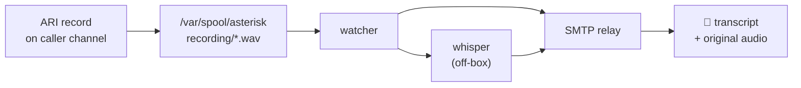

# Roadmap

Feature backlog with acceptance criteria lives in `docs/TASKS.md`; the pack
format and the mechanisms/content line are in `docs/PACKS.md`; the honest
read on funding is `docs/SUSTAINABILITY.md`.

## Phase 2 — voicemail

The shape is settled; the code isn't written. Environment variables for it are
already parsed (and ignored) so the config doesn't churn when it lands.

Notes worth keeping:

- **Record the source, transcribe a copy.** The email carries the original WAV as
  an attachment. Transcription is a convenience, not the artifact — STT will
  mangle names and numbers, and the whole point of a voicemail from a plumber is
  the callback number.
- **Transcription happens off the Pi.** A Pi transcribing a 3-minute voicemail
  while another call comes in is a bad time. Point `STT_ENDPOINT` at a machine
  with headroom; if it's unreachable, still send the email with the audio and a
  note that transcription failed. Never lose the recording because a GPU box
  was rebooting.
- **Offer voicemail only where it makes sense.** A rate-limited caller shouldn't
  get a recording prompt — that's a free channel straight to the inbox. Likely
  rule: offer it after a genuine no-answer on a valid extension, and to
  allow-listed callers when nobody picks up.
- **Retention.** Decide before shipping, not after the disk fills.

## Phase 3 — maybe

- **Schedule-aware policy.** Quiet hours where the house ring group shrinks to
  one handset rather than waking everyone.
- **Prometheus endpoint.** Calls by disposition, PIN failures, ring-to-answer
  latency, trunk registration state.
- **Home Assistant hook.** A webhook on known-caller arrival is a fairly cheap
  way to get a TTS announcement or a light flash.
- **Per-caller routing.** Some allow-listed numbers probably shouldn't ring the
  whole house at 6am; a per-person ring group override covers it.
